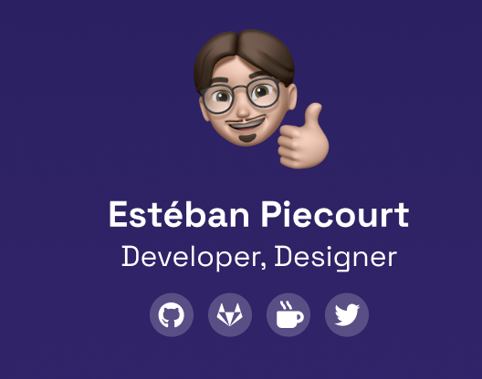
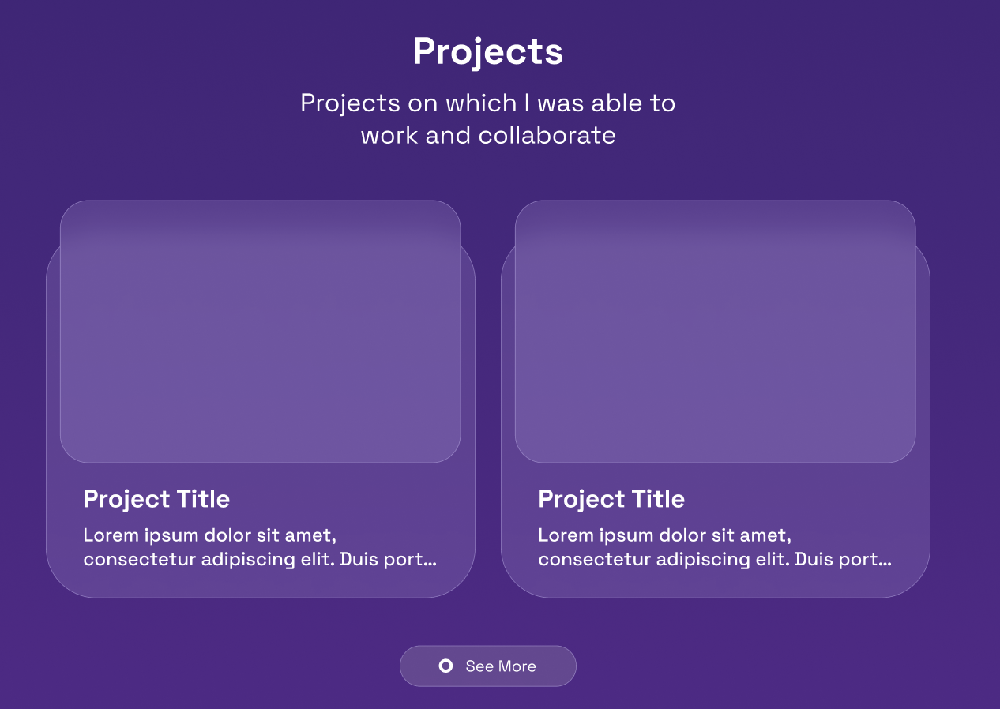
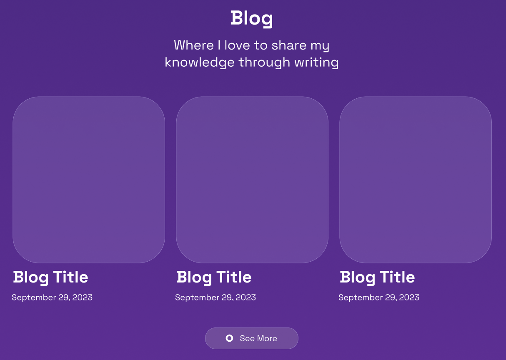

# Charte Graphique - Portfolio

> **Auteur :** Estéban PIECOURT
>
> **Date de création :** 23/10/2023
>
> **Date de mise à jour :** 27/10/2023
>
> **Description :** Description graphique de chaque élements du portfolio de Estéban.

## Thématique

> **Couleurs :** Violet, Rose, Bleu
>
> **Police d'écriture :** Space Grotesk

## Header

### Navigation

## Footer

## Pages

> Description des différentes pages.

- ## Home

  > The home page of my website

  - #### Short About Me
    
  - #### Technologies
    
  - #### Projects
    
  - #### Blog
    
  - #### Call To Action
    

- ## About Me

  > Projects on which I was able to work and collaborate

  

- ## Projects

  > Projects on which I was able to work and collaborate

  

- ## Blog

  > Where I love to share my knowledge through writing

  

- ## Contact

  > Let us know more about you!

  
